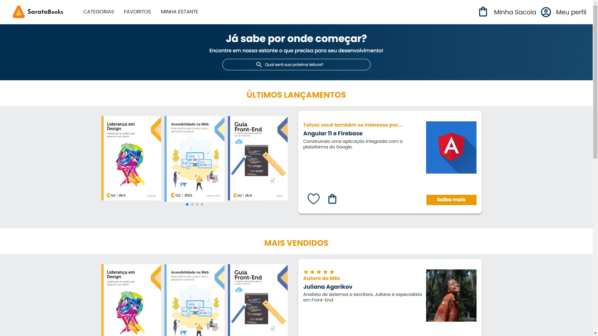

# Multilanguage README Choose your language

 

<h1 align="center">
  💻 SarataBooks PureCSS
</h1>

<h4 align="center"><a href="https://sarata-books.vercel.app/">Click to visit the project</a></h4>

## 📚 Sections

The website with five sections:

-   **Categories:** Different book categories;
-   **Favorites:** Favorited books;
-   **My Shelf:** Acquired books;
-   **Cart:** Items added for purchase;
-   **Profile:** User profile information;

---

## 💼 Technologies Used

This website has been developed using the following technologies:

-   HTML;
-   CSS;

---

<h2>🦄 Author</h2>

<table>
  <tr>
    <td align="center">
      <a href="https://github.com/PasqualiRafael">
         
        
          <b>Pasquali</b>
        
      </a>
    </td>
  </tr>
</table>
