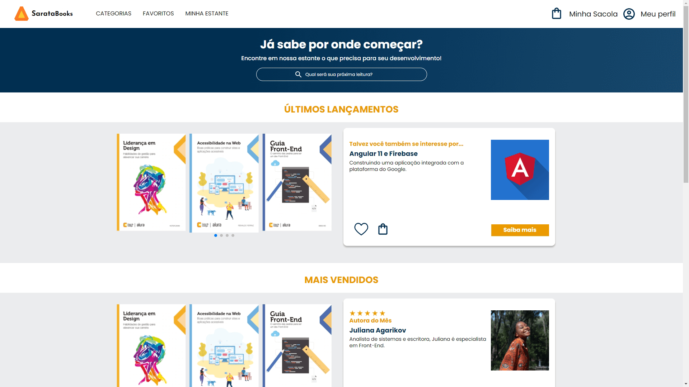

# Multilanguage README Choose your language

 

<h1 align="center">
  💻 SarataBooks PureCSS
</h1>

<h4 align="center"><a href="https://sarata-books.vercel.app/">Clique para visitar o projeto</a></h4>

## 📚 Seções

O site cinco seções:

-   **Categorias:** Categorias diferentes de livros;
-   **Favoritos:** Livros favoritados;
-   **Minha Estante:** Livros adquiridos;
-   **Carrinho:** Itens adicionados para compra;
-   **Perfil:** Informações do perfil do usuário;

---

## 💼 Tecnologias utilizadas

Esse site foi utilizado as seguintes tecnologias:

-   HTML;
-   Css;

---

<h2>🦄 Autor</h2>

<table>
  <tr>
    <td align="center">
      <a href="https://github.com/PasqualiRafael">
         
        
          <b>Pasquali</b>
        
      </a>
    </td>
  </tr>
</table>
